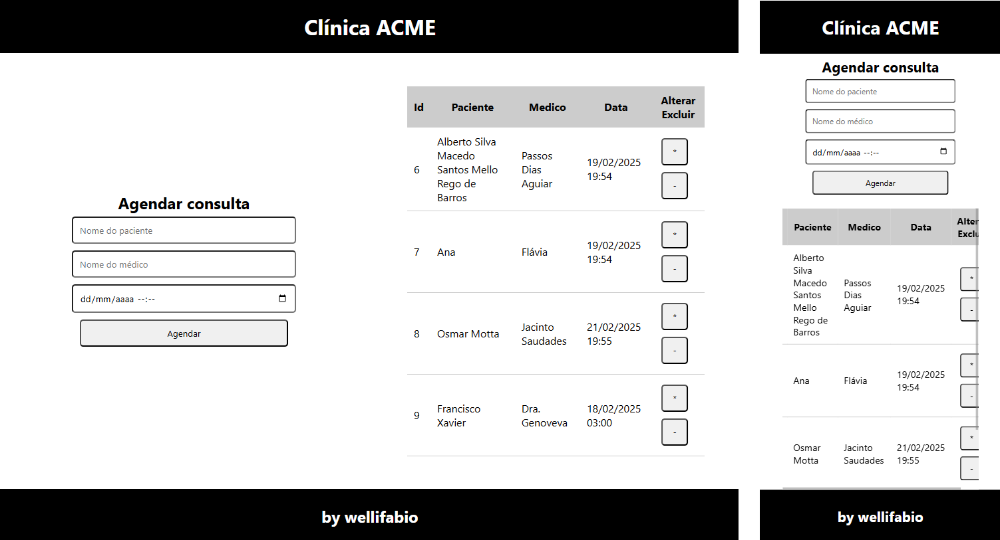

# Projeto Clínica
## Gerenciamento de consultas médicas

## Tecnologias
- VsCode
- XAMPP (MySQL)
- Node.js
- JavaScript (Vanilla)
- HTML
- CSS

## Funcionalidades
- CRUD de consultas médicas

## Como rodar o projeto para testes de ponta a ponta
- 1 Clone o repositório
- 2 Instale o script (**./docs/db.sql**) do banco de dados no MySQL
- 3 Abra a pasta do repositório com o **VsCode**
- 4 Abra um terminal **cmd** pu **bash**, navegue até a pasta **./api**, instale as dependências e execute o **backend**.
```bash
cd api
npm install
npm start
# ou
npx nodemon
```
- 5 Execute o frontend abindo o arquivo **./web/index.html** no navegador ou pelo **Live Server** do VsCode.

### Teste de integração back x banco com Insomnia
- Caso precise testar somente o backend e banco de dados, importe o arquivo **./docs/Insomnia** no Insomnia

### Wireframe
